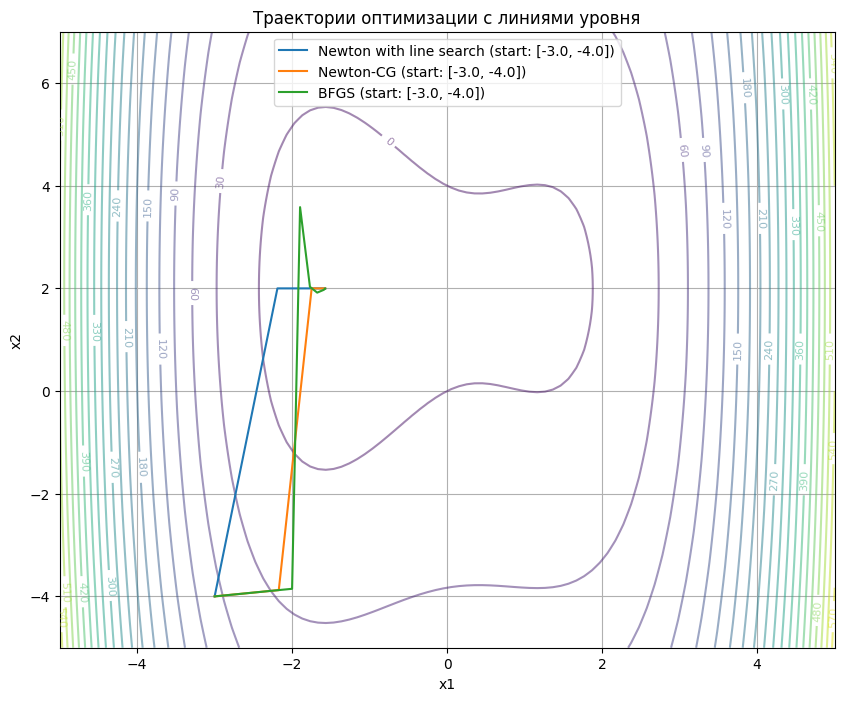
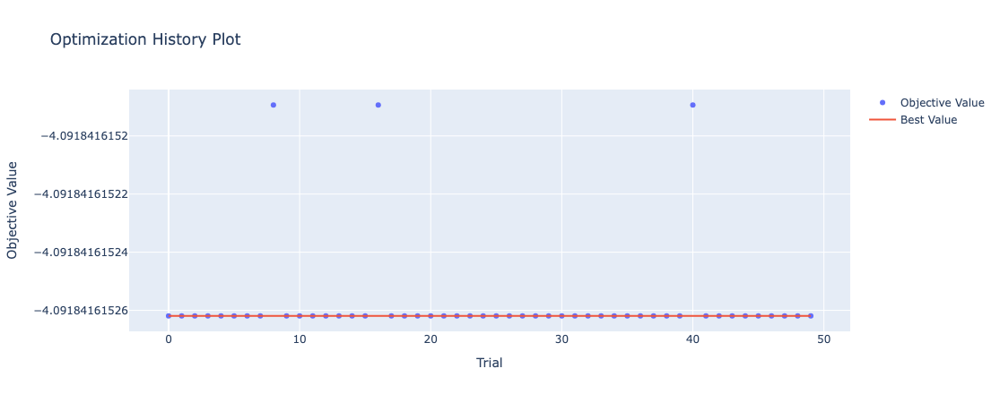
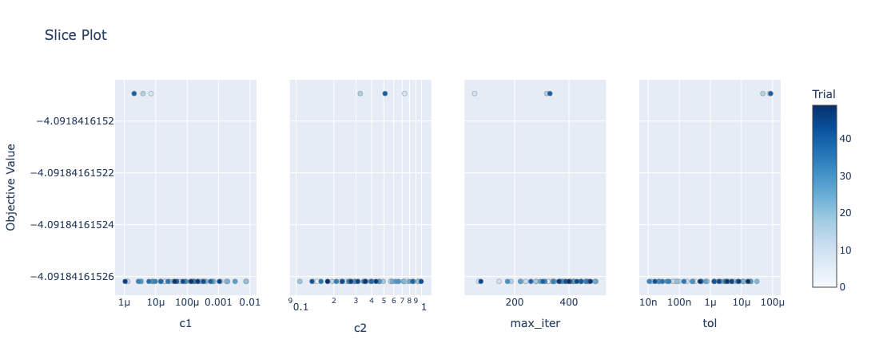
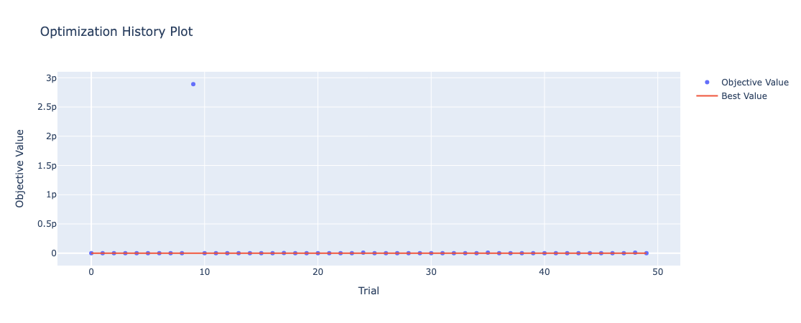
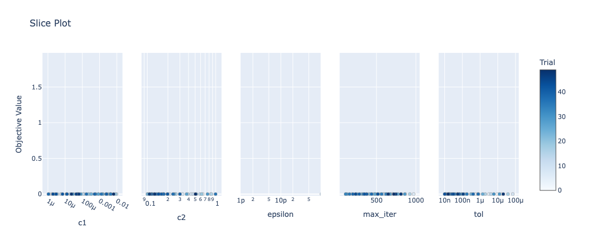

## Метод Ньютона с линейным поиском

### Функция

```python
def f(x):
    return x[0] ** 4 - 4 * x[0] ** 2 + x[1] ** 2 + 3 * x[0] - 4 * x[1]
```

### Метод

```python
def newton_method_with_line_search(f, grad_f, hess_f, x0, max_iter=1000, tol=1e-6,
                                   c1=1e-4, c2=0.9, max_line_search=20):
    ...
```

### Параметры

- `f` - целевая функция
- `grad_f` - градиент функции
- `hess_f` - гессиан функции
- `x0` - начальная точка
- `max_iter` - максимальное число итераций
- `tol` - критерий остановки по норме градиента
- `c1`, `c2` - параметры для условий Вольфе
- `max_line_search` - максимальное число итераций линейного поиска

### Запуск

```python
x0 = np.array([-3.0, -4.0])

methods = {
    'Newton with line search': newton_method_with_line_search(f, f_grad, f_hess, x0),
    'Newton-CG': optimize_with_scipy(f, f_grad, f_hess, x0, method='Newton-CG'),
    'BFGS': optimize_with_scipy(f, f_grad, f_hess, x0, method='BFGS')
}
```



## Квазиньютоновский метод BFGS

### Функция

```python
def rosenbrock(x):
    return 100 * (x[1] - x[0] ** 2) ** 2 + (1 - x[0]) ** 2
```

### Метод

```python
def bfgs_method(f, grad_f, hess_f, x0, max_iter=1000, tol=1e-6, c1=1e-4, c2=0.9,
                max_line_search=20, epsilon=1e-8):
    ...
```

### Запуск

```python
methods = {
    'Newton': newton_method_with_line_search,
    'BFGS': bfgs_method,
    'Newton-CG': lambda f, g, h, x0: optimize_with_scipy(f, g, h, x0, 'Newton-CG'),
    'L-BFGS-B': lambda f, g, h, x0: optimize_with_scipy(f, g, h, x0, 'L-BFGS-B')
}

x0 = np.array([-1.5, 2.0])
```

| Method    | Time (s) | Iterations | Final Value |
|-----------|---------:|-----------:|------------:|
| Newton    |   0.0025 |         23 |    0.000000 |
| BFGS      |   0.0056 |         37 |    0.000000 |
| Newton-CG |   0.0341 |        191 |    0.000000 |
| L-BFGS-B  |   0.0079 |         42 |    0.000000 |

## Optuna

| Функция    | max_iter | tol          | c1           | c2      | epsilon       |
|------------|----------|--------------|--------------|---------|---------------|
| f          | 337      | 3.379 × 10⁻⁶ | 3.589 × 10⁻⁶ | 0.31406 | -             |
| rosenbrock | 441      | 1.191 × 10⁻⁸ | 0.00323      | 0.10146 | 6.051 × 10⁻¹⁰ |

### Метод Ньютона с линейным поиском




## Квазиньютоновский метод BFGS


