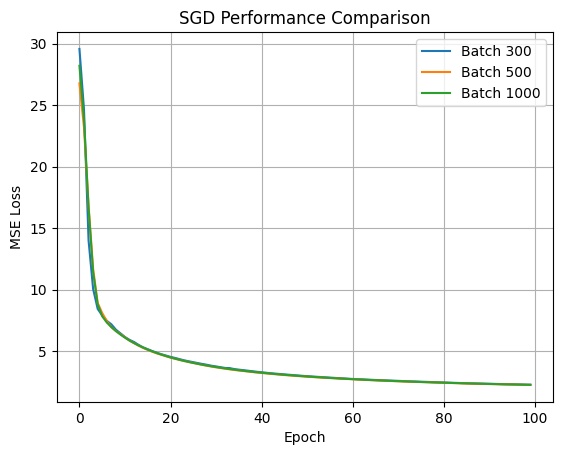
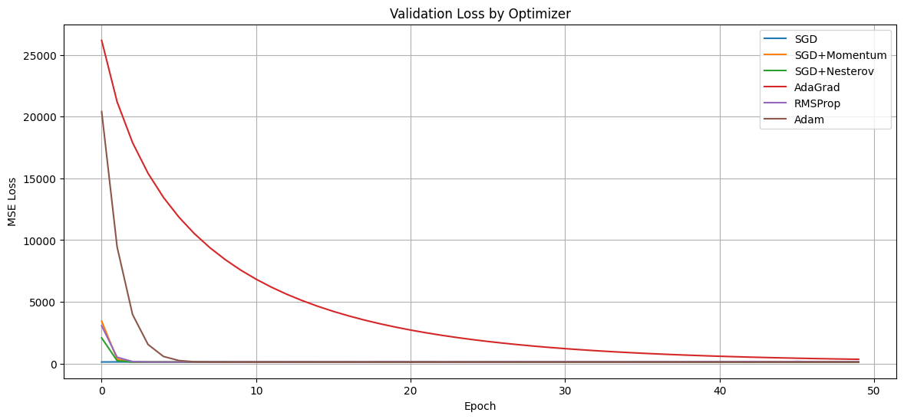
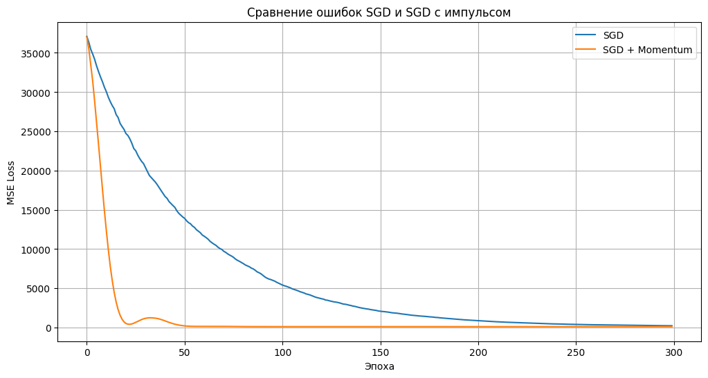
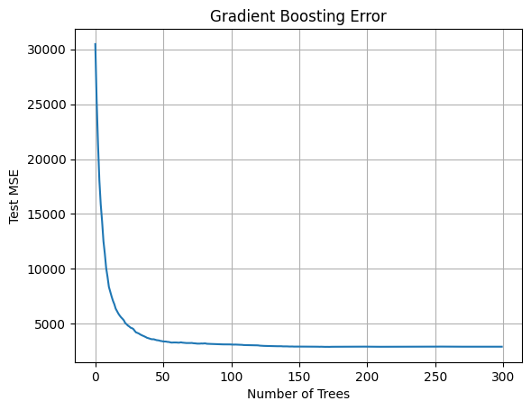
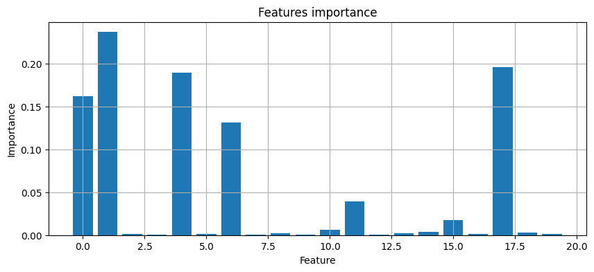

from lab3.main import SGDRegressor

# Отчет по лабораторной работе #3

## SGD Regression

### Params
- `lr=0.01` - default learning rate
- `epochs=100` - количество эпох
- `batch_size=32` - размер пакета
- `lr_schedule` - стратегия lr
- `regularization` - стратегия регуляризации
- `reg_lambda=0.01` - гиперпараметр регуляризации

### Loss plot



### Results

| Batch Size | MSE         | Time (s)   | Memory (MB) | Operations  |
|------------|-------------|------------|-------------|-------------|
| 100        | 1.48074540  | 2.064008   | 40.34375    | 30076200    |
| 250        | 1.47525392  | 0.842097   | 0.19140625  | 50866200    |
| 500        | 1.47956580  | 0.962871   | 0.96875     | 85516200    |
| 750        | 1.48992460  | 0.874419   | 0.13671875  | 120166200   |
| 1000       | 1.48207078  | 0.972094   | 0.0703125   | 154816200   |
| 3000       | 1.48701417  | 1.083386   | 0.484375    | 432016200   |
| 5000       | 1.48770362  | 1.139157   | 0.765625    | 709216200   |
| 7000       | 1.48617585  | 1.256981   | 0.05859375  | 986416200   |

---

В этом исследовании `batch=1000`, `lr_sch=inverse`

| Regularization | MSE         |
|----------------|-------------|
| L1             | 1.68361799  |
| L2             | 1.58701059  |
| Elastic        | 1.63122504  |

В этом исследовании `batch=1000`, `reg=Elastic`

| Learning Rate Schedule | MSE          |
|------------------------|--------------|
| const                  | 6.95358787e+26 |
| step                   | 1.76931654   |
| inverse                | 1.48768444   |

## Dataset
```python
import numpy as np
from sklearn.preprocessing import PolynomialFeatures

def generate_data(n_samples=1000, n_features=1, degree=1, noise=0.1):
    X = np.random.rand(n_samples, n_features)
    poly = PolynomialFeatures(degree)
    X_poly = poly.fit_transform(X)
    true_weights = np.random.randn(X_poly.shape[1])
    y = X_poly @ true_weights + noise * np.random.randn(n_samples)
    return X_poly, y, true_weights
```

- `n_samples=1000` - количество строк
- `n_features=1` - количество столбцов
- `noise=0.1` - шум

## torch.optim

График зависимости MSE от выбранного метода


```python
# Список оптимизаторов
optimizers = {
    'SGD': (torch.optim.SGD, {'lr': 0.1}),
    'SGD+Momentum': (torch.optim.SGD, {'lr': 0.01, 'momentum': 0.9}),
    'SGD+Nesterov': (torch.optim.SGD, {'lr': 0.01, 'momentum': 0.9, 'nesterov': True}),
    'AdaGrad': (torch.optim.Adagrad, {'lr': 2}),
    'RMSProp': (torch.optim.RMSprop, {'lr': 1}),
    'Adam': (torch.optim.Adam, {'lr': 1}),
}
```

## SGD Momentum

```python
class SGDMomentumRegressor:
    def __init__(self, lr=0.01, epochs=100, batch_size=32, momentum=0.9):
        ...
```

Можно сказать, что 

```python
SGDMomentumRegressor(momentum=0) == SGDRegressor
```

Сравнение методов
```python
SGD             = SGDMomentumRegressor(momentum=0)
SGD + Momentum  = SGDMomentumRegressor(momentum=0.9)
```




## Gradient boosting

### Метод
`sklearn.ensemble.GradientBoostingRegressor`

### Параметры
`n_estimators` - количество базовых моделей.

`max_depth` - максимальная глубина каждого дерева в ансамбле.

### Запуск
```python
X, y = make_regression(
    n_samples=1000,
    n_features=20,
    noise=10.0,
    random_state=42)
X_train, X_test, y_train, y_test = train_test_split(
    X,
    y,
    test_size=0.2,
    random_state=42)

model = GradientBoostingRegressor(
    n_estimators=300,
    learning_rate=0.3,
    max_depth=3)
```


