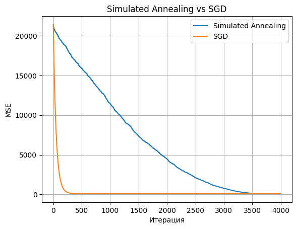
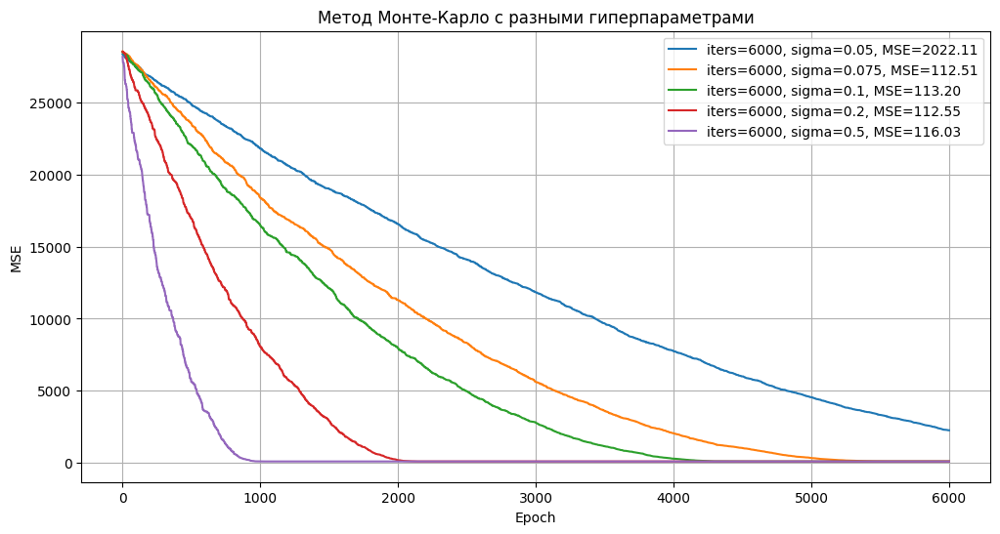
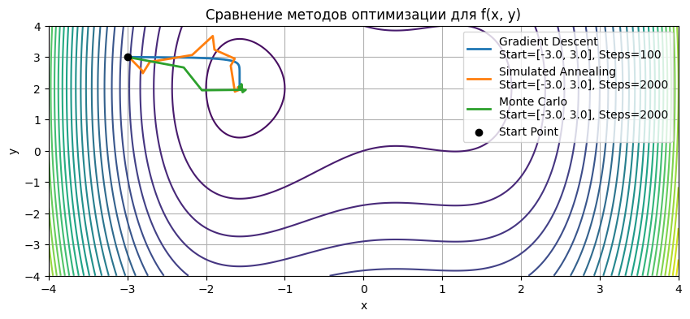
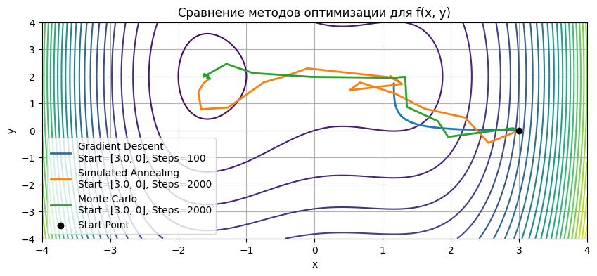
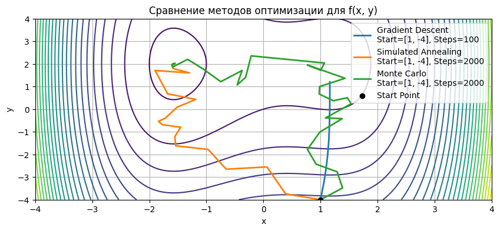
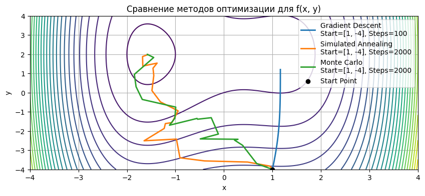

# Отчет по лабораторной работе #4

## Метод отжига

### Метод
```python
class SimulatedAnnealingRegressor:
    def __init__(self, max_iter=4000, initial_temp=1.0, cooling_rate=0.99):
        ...
```
### Параметры
- `max_iter` - количество эпох
- `initial_temp` - изначальная температура, должна быть в интервале `[0, 1]` 
- `cooling_rate` - коэффициент изменения температуры. 

На каждой итерации
```python
T *= cooling_rate
```




## Monte Carlo
### Метод
```python
class MonteCarloRegressor:
    def __init__(self, iters=1000, sigma=0.1, init_scale=1.0):
        ...
```
### Параметры
- `iters` - количество итераций
- `sigma` - стандартное отклонение при мутации весов
- `init_scale` - масштаб случайной инициализации




## Сравнение стохастических методов в задаче поиска минимума функции

### Функция
```python
def f(x, y):
    return x**4 - 4*x**2 + y**2 + 3*x - 4*y
```
### Запуск






## Применение
Одним из наиболее эффективных методов является поиск по дереву Монте-Карло (MCTS), который использует стохастическую оптимизацию для оценки множества возможных ходов через случайные симуляции, балансируя между исследованием новых стратегий и использованием уже проверенных. Например, в AlphaGo MCTS в сочетании с нейронными сетями позволил достичь сверхчеловеческого уровня игры, находя неочевидные ходы, а в Total War: Rome II он помогает ИИ принимать тактические и стратегические решения в условиях неопределенности, таких как выбор между атакой или обходом укреплений.

Поиск по дереву Монте-Карло (MCTS) — 
это алгоритм стохастической оптимизации, используемый в ИИ
 для принятия решений в играх. Он работает в четыре этапа:
  выбор узла игрового дерева с использованием критерия 
  (например, UCB1) для баланса исследования и использования,
   расширение дерева добавлением нового хода, симуляция случайной игры до её завершения и обновление статистики узлов на основе результата. Многократное повторение этих шагов позволяет MCTS находить оптимальные ходы, оценивая их через статистику симуляций.
